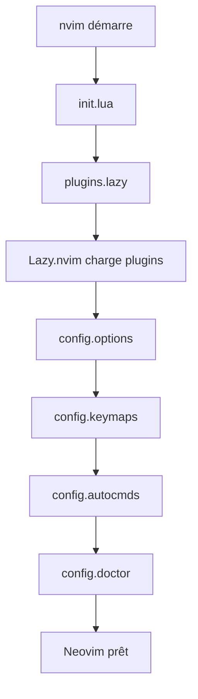

# Architecture du projet Neovim IntelliJ-like IDE

## 📁 Structure du projet

```
neovim-intellij-ide/
├── .github/                  # GitHub Actions CI/CD
│   ├── workflows/
│   │   ├── install-check.yml # Test installation multi-distro
│   │   ├── lint.yml          # Lint shell/lua/markdown
│   │   └── validate.yml      # Validation pre-commit
│   └── ISSUE_TEMPLATE/       # Templates issues/PRs
│
├── nvim/                     # Configuration Neovim
│   ├── init.lua             # Point d'entrée
│   ├── lazy-lock.json       # Lock versions plugins
│   └── lua/
│       ├── config/          # Configuration globale
│       │   ├── options.lua      # Options Neovim
│       │   ├── keymaps.lua      # Raccourcis clavier
│       │   ├── autocmds.lua     # Autocommands
│       │   └── doctor.lua       # Diagnostic santé
│       └── plugins/         # Plugins organisés par domaine
│           ├── lazy.lua         # Plugin manager
│           ├── ui.lua           # Interface (theme, statusline, etc.)
│           ├── lsp.lua          # Language servers
│           ├── completion.lua   # Autocomplétion
│           ├── formatting.lua   # Formatters/linters
│           ├── telescope.lua    # Recherche fuzzy
│           ├── git.lua          # Git workflow
│           ├── navigation.lua   # Navigation avancée
│           ├── devops.lua       # K8s, Terraform, Ansible
│           ├── docker.lua       # Docker intégration
│           ├── database.lua     # SQL/BDD
│           ├── http.lua         # REST client
│           ├── terminal.lua     # Terminal intégré
│           ├── debug.lua        # DAP debugging
│           ├── tests.lua        # Test runners
│           ├── ai.lua           # Claude Code
│           ├── syntax.lua       # Coloration syntaxique
│           └── treesitter.lua   # Treesitter (désactivé)
│
├── scripts shell            # Scripts d'installation et maintenance
│   ├── install.sh          # Installation complète
│   ├── uninstall.sh        # Désinstallation
│   ├── healthcheck.sh      # Vérification santé
│   ├── clean-restart.sh    # Nettoyage cache/plugins
│   ├── intellij-migrate.sh # Migration IntelliJ keymaps
│   └── validate.sh         # Validation pre-commit
│
├── documentation            # Documentation projet
│   ├── README.md           # Documentation principale
│   ├── GETTING_STARTED.md  # Guide démarrage rapide
│   ├── TROUBLESHOOTING.md  # Guide dépannage
│   ├── CONTRIBUTING.md     # Guide contribution
│   ├── ARCHITECTURE.md     # Ce fichier
│   ├── CHANGELOG.md        # Historique versions
│   ├── ROADMAP.md          # Plan évolution
│   └── VERSIONING.md       # Politique versioning
│
└── configuration            # Fichiers configuration
    ├── .luacheckrc         # Configuration luacheck
    ├── .stylua.toml        # Configuration stylua (si existe)
    └── .editorconfig       # Configuration éditeur (si existe)
```

## 🏗️ Architecture logicielle

### Flux d'initialisation



### Organisation des plugins

Les plugins sont organisés par **domaine fonctionnel** :

#### 1. Core IDE (UI/UX)

- `ui.lua` : Interface utilisateur (theme, statusline, notifications)
- `telescope.lua` : Recherche fuzzy (fichiers, buffers, symboles)
- `navigation.lua` : Navigation avancée (leap, harpoon, marks)

#### 2. Development (Code)

- `lsp.lua` : Language servers (ts_ls, yamlls, terraformls, etc.)
- `completion.lua` : Autocomplétion (nvim-cmp, snippets)
- `formatting.lua` : Formatters et linters (none-ls)
- `syntax.lua` : Coloration syntaxique native

#### 3. Version Control

- `git.lua` : Git workflow (gitsigns, neogit, octo.nvim, fugitive)

#### 4. DevOps/Infrastructure

- `devops.lua` : Kubernetes, Terraform, Ansible, Helm
- `docker.lua` : Docker containers/images/volumes
- `database.lua` : SQL, vim-dadbod-ui
- `http.lua` : REST client (rest.nvim, kulala.nvim)

#### 5. Testing & Debugging

- `tests.lua` : Test runners (neotest)
- `debug.lua` : DAP debugging (nvim-dap, dap-ui)

#### 6. Productivity

- `terminal.lua` : Terminal intégré (toggleterm, overseer)
- `ai.lua` : Claude Code (assistance IA)

## 🔧 Principes d'architecture

### 1. Modularité

- **Un fichier = un domaine** : chaque plugin file gère un domaine spécifique
- **Lazy loading** : plugins chargés à la demande (ft, cmd, keys, event)
- **Dépendances explicites** : déclarées dans chaque plugin

### 2. Configuration native Neovim 0.11

- Utilise `vim.lsp.config()` au lieu de lspconfig legacy
- API LSP native pour performance optimale
- Compatibilité avec futures versions

### 3. Fallbacks & Safety

- Checks de disponibilité (`pcall`, `command -v`)
- Timeout pour opérations longues (Lazy sync, TSUpdate)
- Modes dry-run pour scripts critiques
- Backups automatiques avant modifications

### 4. Industrialisation

- **CI/CD** : GitHub Actions pour lint/test/install
- **Validation** : Script pre-commit (`validate.sh`)
- **Documentation** : README, TROUBLESHOOTING, CONTRIBUTING
- **Versioning** : SemVer strict avec CHANGELOG

## 🚀 Workflow de développement

### Ajout d'un nouveau plugin

1. **Créer/modifier** le fichier domaine : `nvim/lua/plugins/domaine.lua`
2. **Structure** :

```lua
return {
  {
    "auteur/plugin",
    dependencies = { ... },
    event = "VeryLazy",  -- ou ft, cmd, keys
    opts = { ... },
    config = function() ... end,
    keys = {
      { "<leader>x", "<cmd>Command<cr>", desc = "Description" },
    },
  },
}
```

3. **Tester** : `:Lazy sync` puis `:checkhealth`
4. **Valider** : `./validate.sh`
5. **Documenter** : mettre à jour README.md

### Ajout d'un nouveau LSP

1. **Ajouter** dans `nvim/lua/plugins/lsp.lua` :
   - `ensure_installed` : nom du serveur
   - `servers` : configuration serveur
2. **Installer** : `:MasonInstall nom_du_serveur`
3. **Tester** : ouvrir fichier du langage, vérifier LSP actif
4. **Documenter** : section "Langages supportés" dans README

### Modification d'un script shell

1. **Éditer** le script
2. **Valider syntaxe** : `shellcheck -x script.sh`
3. **Tester** : `./script.sh --dry-run`
4. **Commit** : message conventionnel `fix(install): ...`

## 📊 Métriques du projet

- **19 fichiers plugins** Lua
- **5 scripts** shell d'automatisation
- **12+ LSP servers** configurés
- **50+ keymaps** productivité
- **3 GitHub Actions** CI/CD
- **7 fichiers** documentation

## 🔒 Sécurité & Best Practices

### Scripts shell

- ✅ `set -euo pipefail` systématique
- ✅ Shellcheck sur tous les scripts
- ✅ Quotes autour variables (`"$VAR"`)
- ✅ Modes dry-run et verbose
- ✅ Backup avant modifications destructives

### Lua

- ✅ Luacheck pour lint
- ✅ Stylua pour formatage
- ✅ `pcall` pour appels potentiellement failing
- ✅ Guards pour fonctionnalités optionnelles

### Git

- ✅ Validation pre-commit (`validate.sh`)
- ✅ Lock file (`lazy-lock.json`) versionné
- ✅ Commits conventionnels
- ✅ CI/CD sur chaque PR

## 🎯 Roadmap architecture

### Court terme

- [ ] Pre-commit hooks Git automatiques
- [ ] Tests unitaires Lua (busted)
- [ ] Benchmarks performance (vim-startuptime)

### Moyen terme

- [ ] Profils utilisateur (js/devops/full)
- [ ] Configuration par projet (.nvim.lua)
- [ ] Plugin custom pour IDE doctor

### Long terme

- [ ] Support multi-OS (macOS, Windows WSL)
- [ ] Distribution via package managers
- [ ] IDE cloud (SSH remote)

## 📚 Ressources

- [Lazy.nvim docs](https://github.com/folke/lazy.nvim)
- [Neovim LSP guide](https://neovim.io/doc/user/lsp.html)
- [Mason registry](https://mason-registry.dev)
- [Awesome Neovim](https://github.com/rockerBOO/awesome-neovim)
