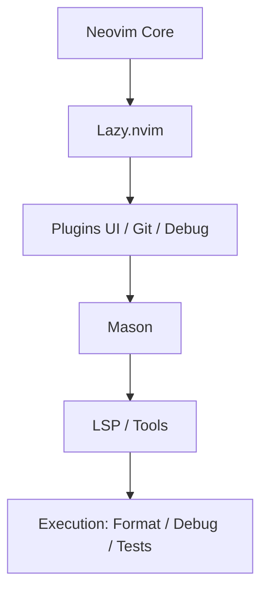

# Neovim IntelliJ‑like IDE

Configuration **Neovim ≥ 0.11** clé en main visant à reproduire l’expérience **IntelliJ Ultimate** :
navigation rapide, refactorings, debug, tests, Docker, LSP complet et workflow DevOps-friendly.

Ce setup est pensé pour :
- développeurs backend / full‑stack
- DevOps / Platform engineers
- utilisateurs IntelliJ souhaitant migrer progressivement vers Neovim

---

## 🧩 Fonctionnalités globales

### Interface & UX (IDE-like)
- Thème **Tokyonight**
- Statusline **Lualine**
- Onglets **Bufferline**
- Explorateur de fichiers **NvimTree**
- Notifications & cmdline avancés (**Noice**)
- Menus contextuels améliorés (**Dressing**)
- Aide dynamique des raccourcis (**Which‑key**)
- Icônes (**nvim-web-devicons**, **mini.icons**)

### Navigation & Projet
- Recherche fichiers / texte / symboles (**Telescope**)
- Détection automatique de projet (**project.nvim**)
- Outline / Structure view (**Aerial**)
- Diagnostics centralisés (**Trouble**)

### LSP & Intelligence de code
- Gestion des serveurs via **Mason**
- Configuration LSP native Neovim 0.11 (`vim.lsp.config`)
- Breadcrumbs (symboles) dans la winbar (**nvim-navic**)
- Complétion (**nvim-cmp**) + snippets (**LuaSnip**)

### Qualité & formatage
- **none-ls (ex null-ls)** pour formatters & linters
- Format on save
- Installation outillage via Mason (on‑demand)

### Git
- Gitsigns (blame, hunks)
- Neogit (UI Git)
- Diffview

### Run / Debug / Tests
- Terminal intégré (**ToggleTerm**)
- Runner de tâches (**Overseer**)
- Debug (**nvim-dap**, dap-ui, dap-virtual-text)
- Tests (**neotest**)

### Docker
- Intégration Docker via Telescope (**telescope-docker.nvim**)

### AI
- Intégration **Claude Code** (agent IA de développement)

---

## 🧠 Langages supportés

### JavaScript / TypeScript
- LSP : `ts_ls`
- Lint : ESLint
- Format : Prettier
- Frameworks : React / Vue / Next.js
- Tests : Jest / Vitest (via neotest)

### HTML / CSS / Tailwind
- LSP : `html`, `cssls`, `tailwindcss`
- Format : Prettier
- Autotag JSX/HTML

### JSON / YAML / Markdown
- LSP : `jsonls`
- Lint : markdownlint
- Format : Prettier

### Prisma
- LSP : `prismals`
- Format : prisma_format

### Bash / Shell
- LSP : `bashls`

### Docker
- LSP : `dockerls`
- Exploration : containers / images / volumes

### Lua
- Treesitter
- Configuration Neovim native

> D’autres langages peuvent être ajoutés facilement via `:Mason`.

---

## 🚀 Installation

```bash
chmod +x install.sh
./install.sh
```

Options utiles :
```bash
./install.sh --dry-run
./install.sh --prefix=$HOME/.local/bin
```

---

## 🔁 Migration IntelliJ → Neovim

Script fourni : **`intellij-migrate.sh`**

Fonctionnalités :
- Keymaps proches d’IntelliJ (Ctrl+P, Ctrl+Shift+F, Alt+Enter, etc.)
- Cheatsheet généré dans `~/.config/nvim/INTELLIJ_MIGRATION.md`
- Activation / désactivation simple

```bash
./intellij-migrate.sh
./intellij-migrate.sh --remove
```

---

## 🧪 Vérification & maintenance

```bash
./healthcheck.sh
```

Commandes utiles :
```vim
:Lazy sync
:Mason
:MasonInstallDevTools
```

---

## 🩺 `:checkhealth` — interpréter les warnings

Certains warnings sont **optionnels** et ne bloquent pas le fonctionnement “IDE”.

- **cargo / ruby / php / composer / julia** : requis uniquement si tu veux installer des outils Mason liés à ces écosystèmes.
- **VCS `hg` (Mercurial)** : uniquement nécessaire si tu utilises Mercurial. Tu peux l’ignorer ou installer `mercurial`.
- **Luarocks / hererocks** : désactivé par défaut (`rocks.enabled=false`) pour éviter des dépendances Lua externes.
- **Providers Neovim** :
  - Node provider : `npm i -g neovim`
  - Python provider : `python3 -m pip install --user -U pynvim`

Le script `install.sh` installe désormais automatiquement `pynvim`, `neovim` (npm) et `tree-sitter-cli`.

## 🧯 Dépannage courant

### Mason en headless (CI / `nvim --headless "+checkhealth"`)
Mason installe des outils **de façon asynchrone**. En mode headless, Neovim peut quitter avant la fin et afficher :
`Neovim is exiting while packages are still installing`.

✅ Ce dépôt évite désormais tout auto-install en headless (ensure_installed vide), et recommande d’installer les outils **à la demande** :
```vim
:MasonInstallDevTools
```


### `:checkhealth lazy` — erreur `lazy-rocks/hererocks/bin/luarocks` not installed
Même si aucun plugin ne requiert `luarocks`, un ancien répertoire `lazy-rocks/` peut déclencher un checkhealth en erreur.

✅ Fix :
```bash
rm -rf ~/.local/share/nvim/lazy-rocks
```
Le script `install.sh` le fait automatiquement.


### Installation

> ⚠️ **Important :** lance les scripts avec **bash** (`./install.sh` ou `bash install.sh`), pas avec `sh`.
 des providers Node (neovim / tree-sitter-cli) très lente
L’étape `npm i -g neovim tree-sitter-cli` peut être lente (réseau, proxy, registry).

Le script `install.sh` :
- tente l’installation avec **retry**
- écrit un log dans `~/.nvim-install-logs/npm-providers.log`
- est **non-bloquant** : en cas d’échec, l’installation continue.

Tu peux aussi accélérer via variables :
```bash
export NPM_CONFIG_AUDIT=false
export NPM_CONFIG_FUND=false
export NPM_CONFIG_PROGRESS=false
```


### `[none-ls/null-ls] failed to load builtin eslint`
`none-ls` fournit nativement **eslint_d** (plus rapide et plus courant en local).  
Le setup utilise donc `eslint_d` et non `eslint`.

✅ Fix :
```vim
:MasonInstall eslint_d
```
ou
```vim
:MasonInstallDevTools
```


### Warning `vim.lsp.buf_get_clients()` deprecated (project.nvim)
`project.nvim` utilise encore `vim.lsp.buf_get_clients()` (supprimé en Neovim 0.12).  
Un patch de compatibilité est appliqué automatiquement via :
- `nvim/after/plugin/project-nvim-compat.lua`
- et une surcharge dans `lua/config/options.lua`

Ce patch n’affecte pas le comportement (il redirige vers `vim.lsp.get_clients()`), et pourra être retiré quand `project.nvim` aura été mis à jour.


### Installation

> ⚠️ **Important :** lance les scripts avec **bash** (`./install.sh` ou `bash install.sh`), pas avec `sh`.
 Lazy / Treesitter “figée”
En mode headless, Neovim est souvent **silencieux** et donne l’impression d’être bloqué, surtout quand Treesitter compile les parsers.

La procédure la plus fiable est de **séparer** l’installation :
```bash
nvim --headless "+Lazy! sync" +qa
nvim --headless "+TSUpdate" +qa
```

Le script `install.sh` fait maintenant exactement ça, avec :
- logs dans `~/.nvim-install-logs/`
- timeouts configurables :
  - `--lazy-timeout=600`
  - `--ts-timeout=900`
- mode verbeux :
```bash
./install.sh --verbose
```

Si ça bloque encore, ouvre les logs :
- `~/.nvim-install-logs/lazy-sync.log`
- `~/.nvim-install-logs/treesitter-update.log`


### Mason ne trouve pas prettier / markdownlint
```vim
:echo exepath("node")
```
Si vide, relancer Neovim depuis un shell avec NVM actif.

### Treesitter manquant
```bash
nvim --headless "+Lazy! sync" "+TSUpdate" +qa
```

---

## 🧹 Désinstallation

```bash
./uninstall.sh
```

Un backup complet est toujours effectué avant suppression.

---

---


## ✅ CI (GitHub Actions)

Un workflow est fourni dans `.github/workflows/install-check.yml` pour vérifier que:
- l'installation fonctionne sur **Ubuntu** (install réel + `healthcheck.sh`)
- les chemins d'installation sont valides en **Debian** et **Fedora** (dry-run)

## ❓ FAQ (Questions fréquentes)

### ❔ Pourquoi Neovim ≥ 0.11 est requis ?
Cette configuration utilise :
- l’API LSP native `vim.lsp.config`
- des améliorations Lazy.nvim récentes
- une gestion moderne des diagnostics et capacités

Les versions antérieures (0.9 / 0.10) ne sont **pas supportées**.

---

### ❔ Puis-je utiliser cette config sans Node.js ?
Oui **partiellement**.

Sans Node.js :
- LSP fonctionne
- Git / Debug / Tests fonctionnent
- UI complète disponible

Mais tu perds :
- Prettier
- ESLint diagnostics
- Markdownlint

Pour une expérience IntelliJ-like complète, **Node.js est recommandé**.

---

### ❔ Pourquoi utiliser Mason plutôt que des installs système ?
Mason permet :
- des versions cohérentes par projet
- une installation isolée utilisateur
- aucun impact sur le système
- une config reproductible (CI / onboarding)

C’est l’équivalent de ce qu’IntelliJ fait en interne.

---

### ❔ Est-ce que cette config est adaptée à une équipe ?
Oui.

Avantages :
- versionnable (Git)
- reproductible
- profils (`js`, `devops`, `full`)
- documentation intégrée

C’est parfaitement adapté à un usage **équipe / entreprise**.

---

### ❔ Comment ajouter un nouveau langage ?
1. Installer le serveur :
```vim
:Mason
```

2. Ajouter la config LSP dans `lua/plugins/lsp.lua` :
```lua
vim.lsp.config("mon_langage_ls", {})
```

3. (Optionnel) Ajouter formatter/linter via `none-ls`.

---

### ❔ Puis-je désactiver certaines fonctionnalités ?
Oui.

Plusieurs options :
- utiliser un profil (`NVIM_PROFILE=js`)
- commenter un plugin dans `lua/plugins/`
- supprimer le layer IntelliJ (`./intellij-migrate.sh --remove`)

---

### ❔ Pourquoi Lazy.nvim plutôt que Packer ?
Lazy.nvim apporte :
- lazy-loading réel (events, ft, keys)
- meilleure performance au démarrage
- gestion native des dépendances
- diagnostics clairs

C’est aujourd’hui le **standard de facto**.

---

### ❔ Cette config remplace-t-elle IntelliJ ?
Fonctionnellement : **oui dans la majorité des cas**.

Différences :
- Neovim est plus léger et scriptable
- IntelliJ reste plus plug-and-play pour Java/Kotlin
- Neovim est supérieur pour SSH / serveurs distants / DevOps

Beaucoup utilisent les deux selon le contexte.

---

### ❔ Où sont stockés mes paramètres ?
- Config : `~/.config/nvim`
- Plugins : `~/.local/share/nvim`
- Cache : `~/.cache/nvim`

Les scripts fournis font toujours un **backup** avant modification.

---


---

## 🏗️ Architecture du setup Neovim IDE

### Vue conceptuelle

```text
┌──────────────┐
│   Neovim     │
│  (core 0.11) │
└──────┬───────┘
       │
       ▼
┌────────────────────┐
│     Lazy.nvim      │  ← Plugin manager (load order, events)
└──────┬─────────────┘
       │
       ▼
┌────────────────────┐
│     Plugins        │
│ UI / Git / Debug   │
│ Tests / Docker     │
└──────┬─────────────┘
       │
       ▼
┌────────────────────┐
│      Mason         │  ← Installer outils externes
└──────┬─────────────┘
       │
       ▼
┌────────────────────┐
│  LSP / Tools       │
│ ts_ls, eslint,     │
│ prettier, dap…     │
└──────┬─────────────┘
       │
       ▼
┌────────────────────┐
│ none-ls / DAP /    │
│ neotest / Overseer│
└────────────────────┘
```

### Mermaid



---


## 🎛️ Profils d’utilisation

> 🔧 **Profil par défaut : `Full`**  
> Ce dépôt est configuré et testé en priorité avec le profil **Full IDE**.
> Les profils `js` et `devops` sont des variantes optionnelles pour alléger certaines fonctionnalités. (JS / DevOps / Full IDE)

Le setup supporte **plusieurs profils** activables par variable d’environnement ou flag.
Cela permet d’alléger Neovim selon ton contexte.

### Profils disponibles

| Profil | Description |
|------|-------------|
| `js` | JavaScript / TypeScript uniquement |
| `devops` | Docker / Bash / YAML / Git |
| `full` | IDE complet (par défaut) |

### Activation par variable d’environnement

```bash
NVIM_PROFILE=js nvim
NVIM_PROFILE=devops nvim
NVIM_PROFILE=full nvim
```

### Logique interne
- Les plugins sont groupés par domaine (js.lua, devops.lua, core.lua)
- `init.lua` charge dynamiquement selon `vim.env.NVIM_PROFILE`
- Par défaut : `full`

*(Exemple de structure)*
```text
lua/plugins/
├── core.lua
├── js.lua
├── devops.lua
└── full.lua
```

---

---

## 🧭 Parcours recommandé

1. Installer le profil **JS only**
2. Activer la migration IntelliJ
3. Ajouter progressivement DevOps
4. Passer en **Full IDE**

---

## 💡 Philosophie

> Neovim comme IntelliJ…  
> mais scriptable, portable, versionnable, et sous ton contrôle.

---

## 📜 License (GPLv3)

This project is distributed under the **GNU General Public License v3.0**.

```
GNU GENERAL PUBLIC LICENSE
Version 3, 29 June 2007

Copyright (C) 2007 Free Software Foundation, Inc.
Everyone is permitted to copy and distribute verbatim copies
of this license document, but changing it is not allowed.

This program is free software: you can redistribute it and/or modify
it under the terms of the GNU General Public License as published by
the Free Software Foundation, either version 3 of the License, or
(at your option) any later version.

This program is distributed in the hope that it will be useful,
but WITHOUT ANY WARRANTY; without even the implied warranty of
MERCHANTABILITY or FITNESS FOR A PARTICULAR PURPOSE.  See the
GNU General Public License for more details.

You should have received a copy of the GNU General Public License
along with this program.  If not, see <https://www.gnu.org/licenses/>.
```


## Notes

- `eslint_d` n’est pas garanti comme builtin core de `none-ls` selon les versions : ce repo le charge via `none-ls-extras` (fallback vers `eslint` si nécessaire).
- `nvim/lazy-lock.json` est fourni comme point de départ : exécute `:Lazy sync` puis commit le lock pour figer les versions.


---

## 📌 Versioning & Roadmap

- Politique de versioning : voir `VERSIONING.md`
- Plan d’évolution : voir `ROADMAP.md`

---

## 🩺 Diagnostic rapide

Après installation, tu peux lancer :

```vim
:IdeDoctor
```

Cela vérifie notamment : version Neovim, binaires essentiels (`git`, `rg`, `fd`, `node`, `python3`), présence de Mason/none-ls.

---

## 🤔 Pourquoi ce repo plutôt que LazyVim/AstroNvim ?

- **Approche “IntelliJ-like”** : keymaps, UX et plugins choisis pour une expérience IDE cohérente (pas un framework généraliste).
- **Indus-friendly** : scripts d’installation, CI (lint + smoke test), fichiers OSS standards, SemVer.
- **Lisible** : plugins organisés par domaine (`lua/plugins/*`), conventions simples, configuration explicite.
- **Opt-in** : les features avancées (ex: AI) restent modulaires et évitent le lock-in.

---

## 📦 Releases

- Notes de release prêtes : `releases/v1.0.0.md`
- Roadmap : `ROADMAP.md`
- Versioning : `VERSIONING.md`
